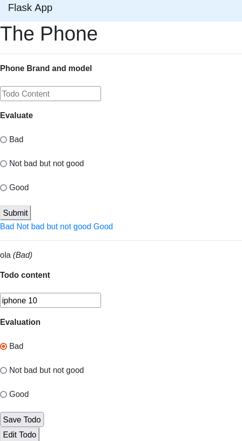
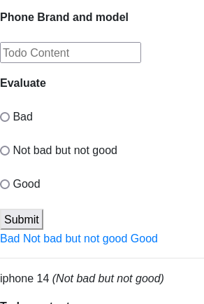

# Getting Started

## Prerequisites
### To install the project
install python if you don't have it already
```pip install flask```
```pip install pymongo```

### To run the project
```python app.py```

### To run the tests
```python test_app.py```

## The project
### Authentication
The project uses a simple authentication system. The user can register and login. The user can also logout. The user can only access the home page if he is logged in. 

To Set this Up I created a post method for the register page. This method takes the username and password from the form and stores it in the database. I also created a post method for the login page. This method takes the username and password from the form and checks if it matches the username and password in the database. If it does, the user is logged in and redirected to the home page. If it doesn't, the user is redirected to the login page. I also created a get method for the logout page. This method logs the user out and redirects him to the login page.

### Display
The project show all the phones in the database. The user can also add a phone to the database. 

He can decide weither the phone is a bad, not bad or good phone.
The second particularity is that we can see only the type of phone we want. 

To know all the bad phones that are registered for instance.

To set up the display, I created first of all a form to create new phones.
After, I put the delete buttons in the same page than the home one, and the update button that is also in the same page.
Finally, I put an option in the index view that take in consideration the degree parameter so that we can see only the phones that we want.
